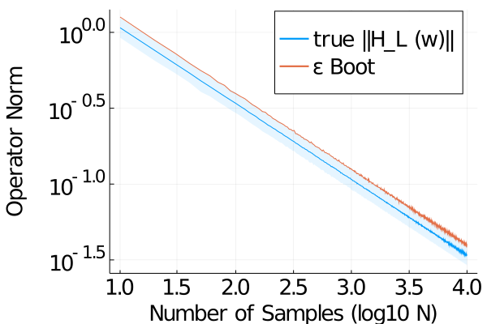
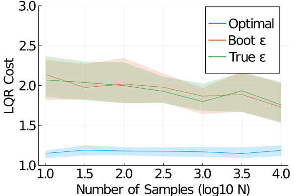
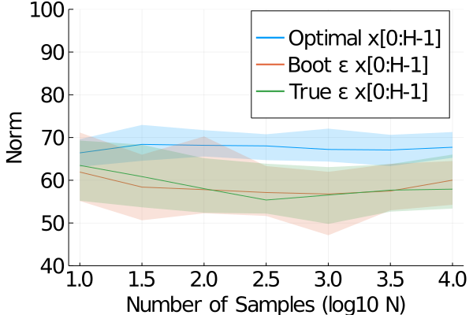
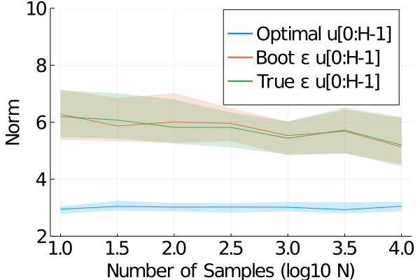

# L4DC 2021 Experiments
This directory contains the files necessary to reproduce our L4DC 2021 experiments.

## Dependencies
These experiments were run with the following software
* Julia (>= 1.3.1)
* Jupyter Notebook (>= 5.7.10)
* MOSEK (>= 9.29)

Missing Julia packages can be installed as follows:
	1. Run `julia` from the terminal to launch the interactive environment
	2. `using Pkg` imports Julia's built-in package manager
	3. `Pkg.add("Statistics")` will install Julia's [Statistics](https://docs.julialang.org/en/v1/stdlib/Statistics/) package, for example

## Experiment 1: Bootstrapping
This experiment is contained in the `L4DC Sample Complexity.ipynb` file. This file contains code that
1. Generates `N = 10, 20, 30, ...,10000` different `H_L (w)` matrices and computes their average
2. Calculates their norm (`opnorm`)
3. Stores and plots data

Running all of the code blocks (not including time to import and pre-compile packages) takes around 300 seconds, depending on the machine. A pre-computed image is stored in `Hwnorms.png`.

The x-axis displays different values of `N` in `log10` scale. The solid blue line is the mean of `opnorm` of `N` different independent `H_L (w)` averaged together, with the `0.05` and `0.95` quantiles shaded. The bootstrap epsilon is the `0.95` quantile, sampled independent from the blue data and drawn in orange.

## Experiment 2: MPC Loop
The code for this is split into two files:
* `L4DC Controller Synthesis.ipynb` which runs the MPC experiments
* `L4DC Data Processing.ipynb` which plots data from the experiments. This file is rather straightforward, so we focus on the controller synthesis part.

The `L4DC Controller Synthesis.ipynb` file defines
* Data structures for the LTI system, as in the paper
* Data structures for the LQR cost function
* An optimization routine call to `MOSEK` in order to synthesize the `G` matrix
* Sanity checks to ensure that system constraints hold
* MPC loop with different control schemes (optimal, naive, robust bootstrap-epsilon, robust true-epsilon)

The following are saved from running the MPC loop experiment:
* `Jstars.txt` contains the optimal controller cost data
* `Jnoms.txt` contains the nominal controller cost data 
* `JrobBs.txt` contains the robust boostrap-epsilon controller cost data
* `JrobTs.txt` contains the robust true-epsilon controller cost data

Following this naming convention,
* `normx*.txt` contains the `||x[0:H-1]||` data for its respective controller
* `normu*.txt` contains the `||u[0:H-1]||` data for its respective controller

Pre-computed plots are available in `lqr-costs.png`, `xnorms.png`, and `unorms.png`.

#### LQR Cost
Shown below are the LQR costs of the optimal, robust bootstrap epsilon, and robust true epsilon controllers in an MPC loop over control horizon `H = 1000` (with `Q = 1e-3 I` , `R = I`, and `sigma = sqrt(0.1)`) for different sample counts `N`. The 1st and 3rd quartiles are shaded for each. The naive (nominal) controller is omitted because it consistently blows up due to instability.

#### State and input norms
Shown below are the norms of the states and controls of the system over the MPC loop over different number of samples `N`. Again, we omit the naive controller as it is consistently unstable.

